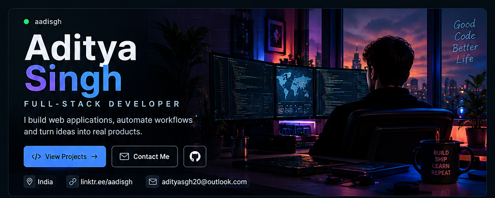
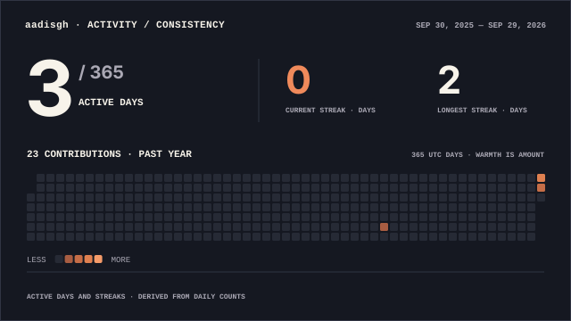
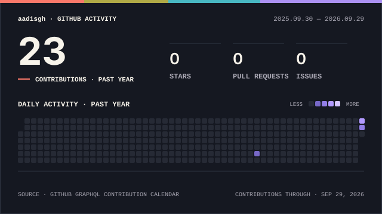
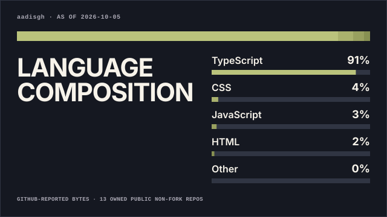

<div align="center">



<br><br>

<a href="https://adityas.vercel.app/">
  
</a>
<a href="https://github.com/aadisgh">
  
</a>
<a href="mailto:adityasgh20@outlook.com">
  
</a>

<br><br>

**Full-Stack Developer · India**

Building web applications, business systems, APIs and automation workflows.

</div>

<br>

<!-- ======================= HIGHLIGHTS ======================= -->

<div align="center">

<table>
<tr>

<td align="center" width="25%">

### `〈/〉`

**3+**  
<sub>Major Projects</sub>

</td>

<td align="center" width="25%">

### `♙`

**2+**  
<sub>Years Learning</sub>

</td>

<td align="center" width="25%">

### `☕`

**∞**  
<sub>Cups of Coffee</sub>

</td>

<td align="center" width="25%">

### `🚀`

**Always**  
<sub>Building</sub>

</td>

</tr>
</table>

</div>

---

## `~/about-me`

<table>
<tr>

<td width="50%" valign="top" align="center">

### About

<br>

**Aditya Singh**

Full-Stack Developer · India

<br><br>

I turn ideas into practical software.

<br><br>

`Web Applications`  
`Business Systems`  
`REST APIs`  
`Automation`  
`Modern UI/UX`

</td>

<td width="50%" valign="top">

### Current Status

<br>

```text
● Building new products
● Improving React & API architecture
● Exploring AI & automation
● Learning system design
● Writing cleaner software
● Open to collaboration
```

<br>

**Focus**

`Web Development` · `APIs` · `Automation` · `UI/UX`

</td>

</tr>
</table>

<br>

### `developer.js`

```javascript
const developer = {
  name: "Aditya Singh",
  username: "aadisgh",
  role: "Full-Stack Developer",
  location: "India",

  building: [
    "Web Applications",
    "Business Systems",
    "Automation Tools"
  ],

  learning: [
    "React",
    "System Design",
    "AI & Automation"
  ],

  mindset: "Build → Ship → Learn → Improve"
};
```

---

## `01 / TECH STACK`

<div align="center">

**Frontend**


<br><br>

**Backend**


<br><br>

**Database & Services**


<br><br>

**Tools**


</div>

---

## `02 / FEATURED PROJECTS`

<table>
<tr>

<td width="33%" valign="top">

### TrackFlow Pro

**Logistics & Shipment Management**

Shipment tracking, client dashboards, billing, operational workflows and business automation.

**Built with**

`React` `Node.js` `Supabase`

<br>

[**View Repository →**](https://github.com/aadisgh)

</td>

<td width="33%" valign="top">

### ConnectX

**Real-Time Communication**

Modern chat application with authentication, live messaging and interactive UI.

**Built with**

`React` `Node.js` `MongoDB` `Socket.IO`

<br>

[**View Repository →**](https://github.com/aadisgh)

</td>

<td width="33%" valign="top">

### Portfolio

**Personal Developer Website**

A personal website for showcasing projects, skills and technical work.

**Built with**

`React` `Tailwind CSS` `Vite`

<br>

[**Open Portfolio →**](https://adityas.vercel.app/)

</td>

</tr>
</table>

---

## `03 / GITHUB ACTIVITY`

<div align="center">



</div>

---

## `04 / GITHUB OVERVIEW`

<div align="center">



<br><br>



</div>

---

## `05 / DEVELOPMENT PHILOSOPHY`

<table>
<tr>
<td align="center" width="22%"><strong>BUILD</strong></td>
<td width="78%">Start with an idea</td>
</tr>
<tr>
<td align="center"><strong>BREAK</strong></td>
<td>Find what doesn't work</td>
</tr>
<tr>
<td align="center"><strong>LEARN</strong></td>
<td>Understand why</td>
</tr>
<tr>
<td align="center"><strong>IMPROVE</strong></td>
<td>Make it cleaner</td>
</tr>
<tr>
<td align="center"><strong>SHIP</strong></td>
<td>Put it into the real world</td>
</tr>
</table>

<br>

<div align="center">

> **"Build something today that makes tomorrow easier."**

</div>

---

## `06 / LET'S CONNECT`

<div align="center">

<a href="https://github.com/aadisgh">GitHub</a>
&nbsp; · &nbsp;
<a href="https://adityas.vercel.app/">Portfolio</a>
&nbsp; · &nbsp;
<a href="https://www.linkedin.com/">LinkedIn</a>
&nbsp; · &nbsp;
<a href="https://linktr.ee/aadisgh">Instagram</a>
&nbsp; · &nbsp;
<a href="mailto:adityasgh20@outlook.com">Email</a>

<br><br>

```text
BUILD → SHIP → LEARN → REPEAT
```

<sub>© Aditya Singh · aadisgh</sub>

</div>
